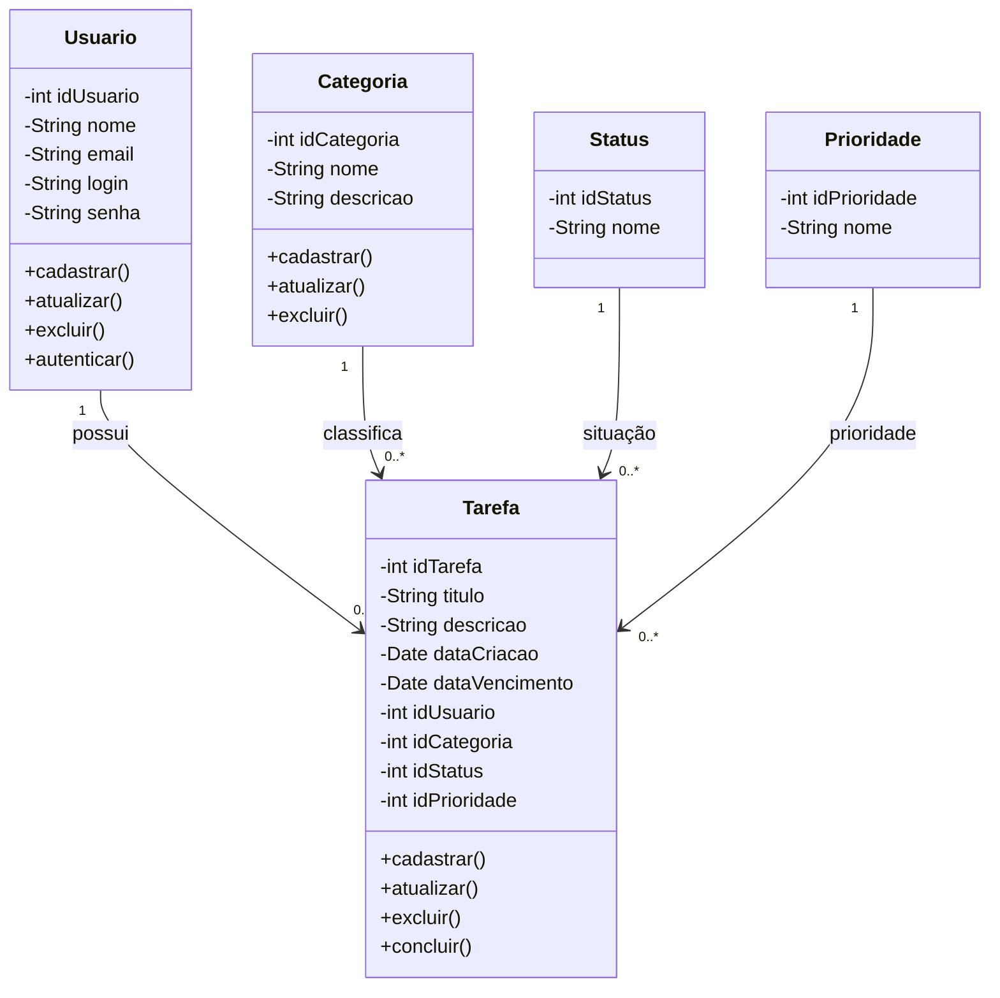
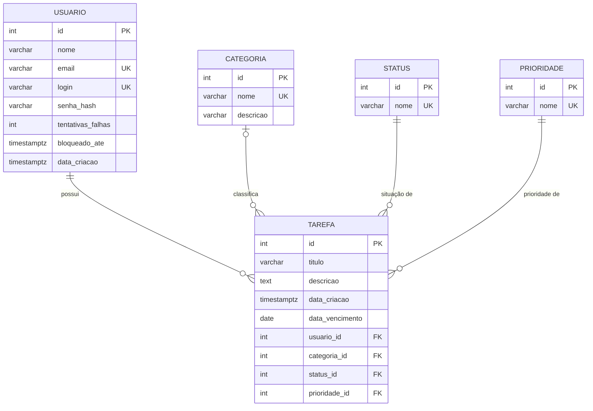

# GerenciadorTarefas_JavaSwing

# Gerenciador de Tarefas

## Sobre o projeto

O **Gerenciador de Tarefas** é um sistema de gerenciamento de tarefas desenvolvido em **Java Swing**, com o objetivo de auxiliar usuários a cadastrar, organizar, acompanhar e concluir suas atividades.

O sistema foi planejado para permitir o gerenciamento de tarefas por meio de informações como **título, descrição, prioridade, categoria, status e prazo**, além de oferecer recursos de cadastro de usuários, login, pesquisa e filtragem.

O projeto foi estruturado pensando em uma aplicação desktop simples e intuitiva, servindo também como prática dos conceitos de **Programação Orientada a Objetos, Java Swing, banco de dados e modelagem de sistemas**.

---

## Objetivo

O principal objetivo do projeto é desenvolver uma aplicação capaz de centralizar e organizar tarefas, permitindo que o usuário acompanhe suas atividades pendentes e concluídas de maneira simples.

Entre as principais funcionalidades planejadas estão:

* Cadastro e login de usuários;
* Cadastro, edição e exclusão de tarefas;
* Definição de prioridade;
* Organização por categorias;
* Controle do status das tarefas;
* Definição de prazo;
* Pesquisa de tarefas;
* Filtros por status e prioridade;
* Visualização das tarefas cadastradas.

---

## Telas do sistema

As telas foram planejadas para manter uma interface simples e objetiva, facilitando a utilização do sistema.

### Tela de Login

Tela responsável pela autenticação do usuário no sistema. Também possui acesso à opção de criação de uma nova conta.


### Tela Principal

É a tela central do sistema, onde o usuário poderá visualizar suas tarefas e utilizar as principais funções, como criar, editar, excluir e concluir tarefas.

Também contará com recursos de pesquisa e filtros por status e prioridade.


### Cadastro de Tarefa

Tela destinada ao cadastro de novas tarefas. Nela serão informados dados como título, descrição, prioridade, categoria, data limite e status.


### Categorias

Tela responsável pelo gerenciamento das categorias utilizadas para organizar as tarefas.


### Cadastro de Usuário

Tela destinada à criação de novos usuários, contendo informações como nome, e-mail, login e senha.


---

## Diagramas

Os diagramas foram desenvolvidos para representar a estrutura e o funcionamento planejado do sistema antes da implementação.

### Diagrama de Classes

O diagrama de classes apresenta as principais entidades do sistema e seus respectivos atributos e métodos.



A senha do usuário é armazenada apenas como hash (PBKDF2), nunca em texto puro.

### Modelo Entidade-Relacionamento

O MER representa a estrutura dos dados que serão utilizados pelo sistema, apresentando as entidades, seus atributos, chaves primárias e estrangeiras e os relacionamentos entre elas.

As principais entidades são:

* **USUARIO**
* **TAREFA**
* **CATEGORIA**
* **STATUS**
* **PRIORIDADE**

Um usuário pode possuir várias tarefas, enquanto cada tarefa pertence a um usuário. Da mesma forma, uma categoria, um status e uma prioridade podem estar relacionados a várias tarefas.

O modelo relacional apresenta a transformação das entidades do MER em tabelas do banco de dados, incluindo suas respectivas chaves primárias (**PK**) e chaves estrangeiras (**FK**).



`tentativas_falhas` e `bloqueado_ate` protegem o login: após 5 senhas erradas seguidas, o acesso fica bloqueado por 5 minutos.

---

## Como executar

1. Instale o PostgreSQL e crie o banco seguindo [banco/README.md](banco/README.md).
2. Rode o sistema de um destes jeitos:
   - **Pelo terminal (VS Code ou qualquer outro)**, na raiz do repositório:

     ```powershell
     powershell -ExecutionPolicy Bypass -File executar.ps1
     ```

     O script compila o projeto e abre a tela de login. Precisa do JDK 17 ou superior instalado.
   - **Pelo IntelliJ:** abra a pasta `GerenciadorTelas` e execute a classe `Main` (`src/Gerenciador/view/Main.java`).
